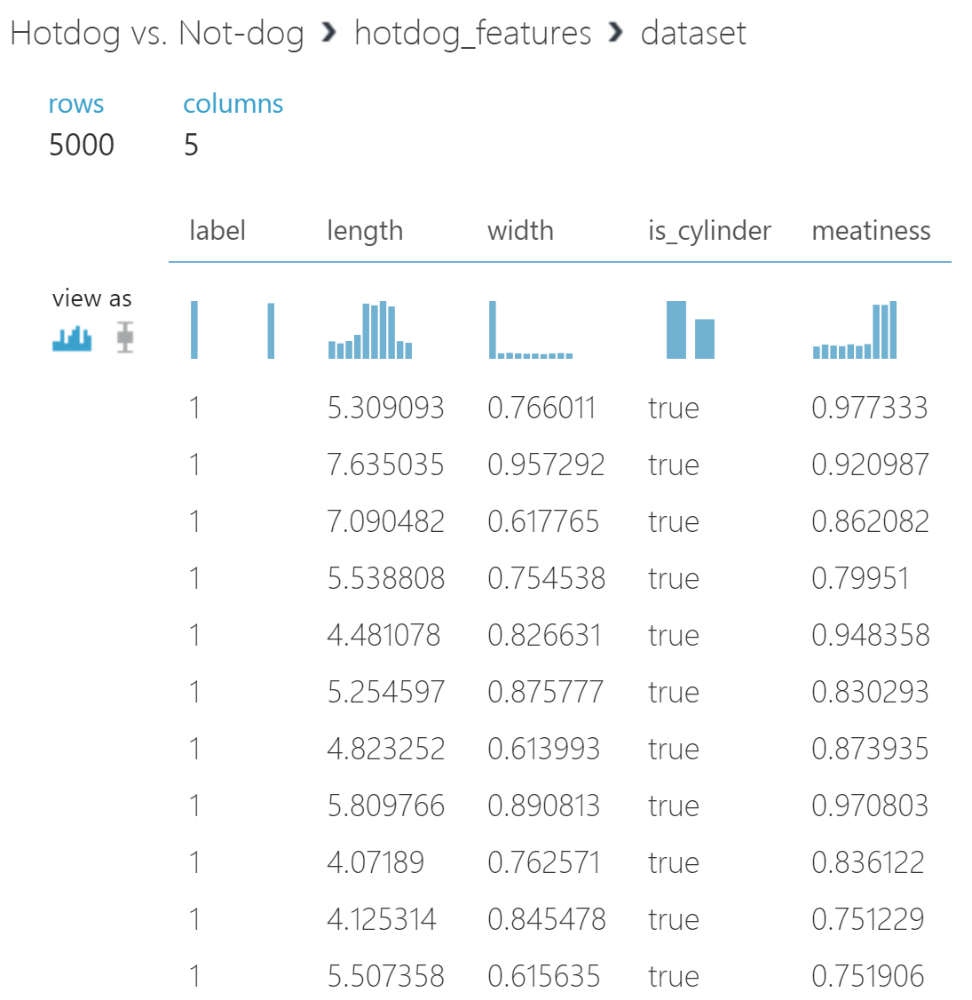
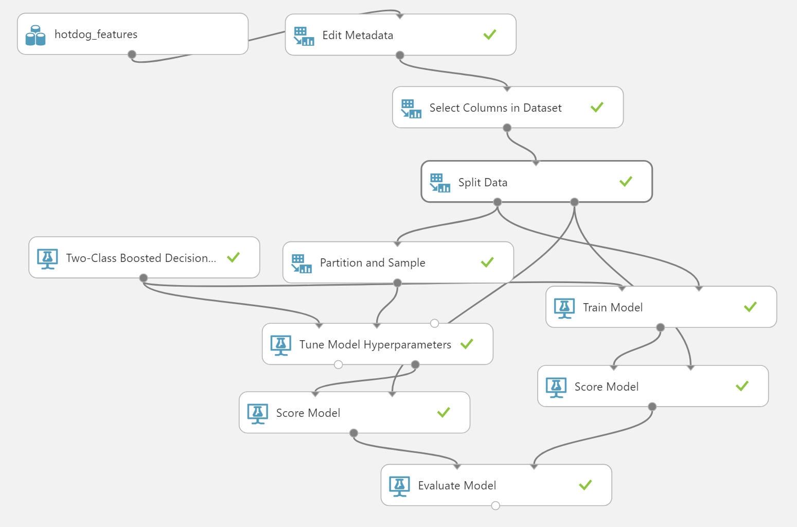
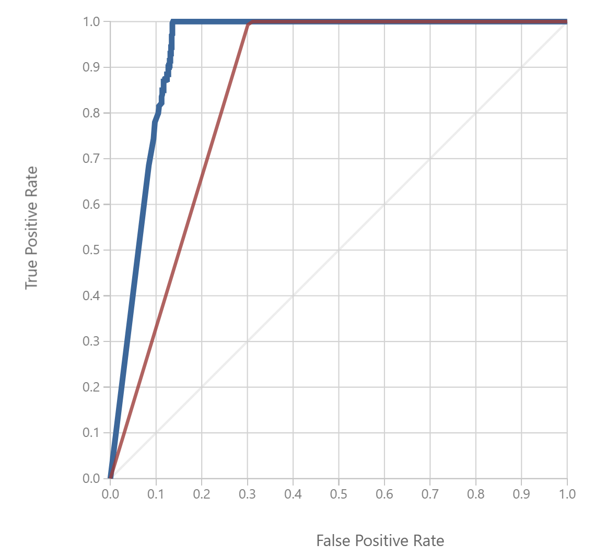

# Microsoft Ready 2017
## Machine Learning for CSE

This is code and supporting materials for a brief talk given during Microsoft Ready 2017 for the newly-minted CSE division (previously DX). A 20 minute talk is not enough to cover the entirety of ML and Deep Learning, so it was pretty abbreviated. To motivate the differences between Cognitive Services, Deep Learning, and Machine Learning I used demos solving the "Hotdog / Not Hotdog" problem from Silicon Valley.

## Replicating Locally

Create a new Anaconda environment using the `environment.yml` file contained in the repository (see [the conda documentation](https://conda.io/docs/using/envs.html#use-environment-from-file)). Execute `img_downloader.py` and `download_model.py` to download images in some categories (via Bing Image Search) and the ResNet18 model we use for transfer learning. Note that you'll need to set the `BING_API_KEY` environment variable or the image download will fail (well, the search will). Please sign up for the Bing Image Search API at [https://portal.azure.com](https://portal.azure.com).

## Custom Vision Service

Training a model in Microsoft's Custom Vision Service is fairly easy (far easier than in CNTK). Head to [the website](https://www.customvision.ai/) and sign in. Once you're in there create a new project, select "food" as your base model, and start uploading the images from our `./images` directory (you _did_ run the `img_downloader.py` script above, didn't you?). Label all hotdog images appropriately and all non-hotdog images appropriately, hit train, and you have a custom Deep Learning model.

You can test your model by hitting "Quick Test" and using the following images:
- Chompies dog: [https://chompies.com/wp-content/uploads/2017/03/HotDog-848x400.png](https://chompies.com/wp-content/uploads/2017/03/HotDog-848x400.png)
- Sad pizza is sad: [https://www.papaginos.com/assets/images/error-sadPizza.jpg](https://www.papaginos.com/assets/images/error-sadPizza.jpg)

## CNTK Transfer Learning

Now that you've downloaded the images and model, you need to validate the images and convert them into a training/testing set for CNTK. Run `img_to_cntk.py` to do that work. You should now be able to run the `CNTK Hot Doggin.ipynb` Jupyter Notebook and train a hotdog prediction model.

## Azure ML Classifier

AzureML is much harder to "check in" (trust me, we've DXFeedbacked this) and for some weird reason I didn't think a hotdog/not-hotdog identifier was worthy of publishing to the gallery, so you'll either have to trust me on this or reproduce some models based on screenshots.

Generate some fake numeric/categorical hotdog/not-hotdog features using `generate_hotdog_features.py` into `hotdog_features.csv`. Go to your [AzureML Studio](https://studio.azureml.net) and hit Datasets, then upload a new dataset from the data you created. 

Now you can create a model to predict hotdoggedness based on those features. Personally, I tried out boosted decision trees both with and without hyperparameter tuning:

The results are pretty solid! Which honestly is not that surprising based on the fact that all of the data is fake and one of the features is `is_cylinder`. I actually used "_Select Columns in Dataset_" to remove some of the more predictive columns just to make the accuracy curves a bit more interesting.

